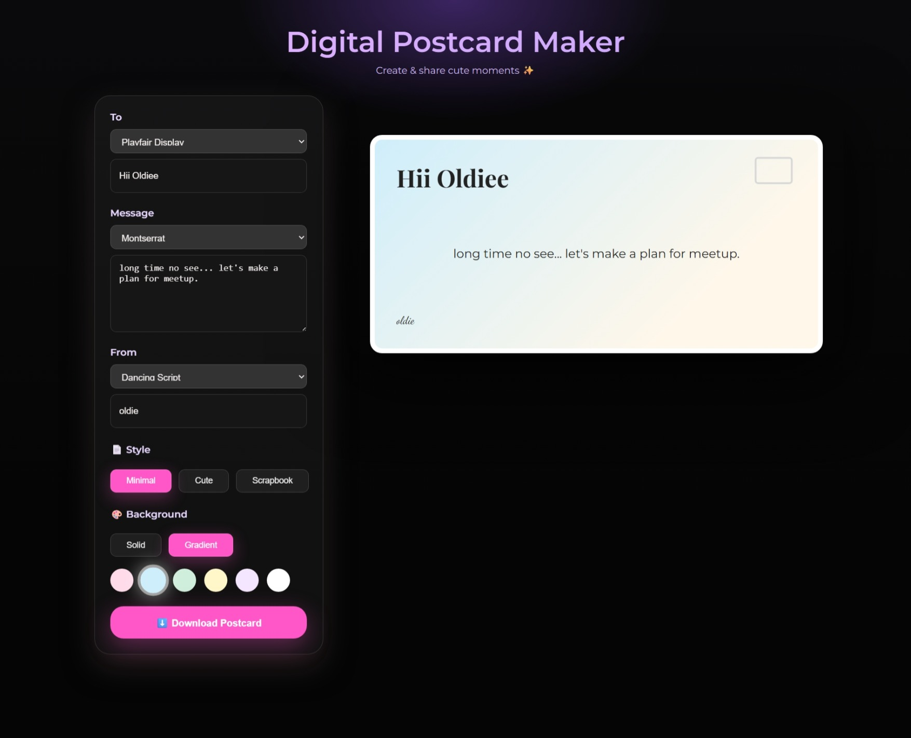
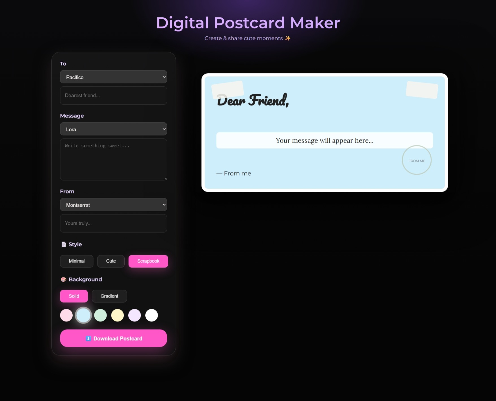

# 💌 Digital Postcard Maker

Create, customize, and download beautiful digital postcards with a cute and modern UI ✨  
This web app lets users write heartfelt messages, choose fonts, switch styles, pick backgrounds, and export their postcard as an image — all in real time.

---

## 🌸 Live Demo

🔗 [View Live Project](https://khushi05sharma.github.io/Digital-Postcard-Maker/)  
📁 [Explore the Repository](https://github.com/khushi05sharma/Digital-Postcard-Maker)

---

## About the Project 💖

**Digital Postcard Maker** is a fun and visually appealing web application that allows users to create personalized postcards with custom text, fonts, styles, and backgrounds.

Built using **HTML**, **CSS**, and **Vanilla JavaScript**, this project focuses on clean UI design, smooth interactions, and real-time preview updates — making the postcard creation process simple, enjoyable, and creative 🌈✨

---

## Features 🌟

✅ Write personalized **To**, **Message**, and **From** text  
✅ Choose different fonts for each text section  
✅ Three postcard styles:

- **Minimal** – clean and elegant
- **Cute** – playful with stars, hearts, and sparkles 💖⭐
- **Scrapbook** – creative with tape and stamp elements 📒  
  ✅ Solid & gradient background selection  
  ✅ Live postcard preview while editing  
  ✅ Download postcard as a PNG image  
  ✅ Fully responsive layout  
  ✅ Smooth UI with glassmorphism-inspired controls

---

## 🛠️ Built With

- **HTML5** – Structure and layout
- **CSS3** – Styling, animations, and responsiveness
- **JavaScript (Vanilla JS)** – Interactivity and live updates
- **html2canvas** – Export postcard as an image

---

## Screenshots 🖼️

> Replace these with your actual screenshots

| Cute Style                  | Minimal Style                     | Scrapbook Style                       |
| --------------------------- | --------------------------------- | ------------------------------------- |
|  |  |  |

---

## Tech Stack 🛠️

| Category | Tools Used |
|--------|------------|
| 💻 Frontend | HTML5, CSS3, Vanilla JavaScript |
| 🎨 Fonts | Google Fonts (Pacifico, Montserrat, Lora, Quicksand, etc.) |
| 🖼️ Export | html2canvas |
| 🎬 Styling | CSS animations, gradients, glassmorphism |
| 📱 Responsiveness | CSS media queries |

---

## Usage 🚀

1. Enter the recipient name in the **To** field  
2. Write your message in the **Message** section  
3. Add your name in the **From** field  
4. Select fonts for each text area  
5. Choose a postcard style (Minimal / Cute / Scrapbook)  
6. Pick a background color or gradient  
7. Preview updates instantly  
8. Click **Download Postcard** to save it 🎉  

---

## Future Enhancements 🌱

 Add more postcard styles and themes  
 Add draggable stickers for Cute mode  
 Save user-created postcards  
 Share postcard directly on social platforms  
 Convert project to **React** version  
 Add light/dark UI toggle  

---

## License 📜

This project is licensed under the **MIT License** — feel free to use, modify, and distribute it.

---

## Installation ⚙️

### Steps

```bash
# 1. Clone the repository
git clone https://github.com/khushi05sharma/Digital-Postcard-Maker.git

# 2. Navigate into the project folder
cd Digital-Postcard-Maker

# 3. Open the project
# Open index.html directly
# OR use Live Server in VS Code